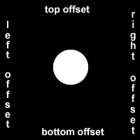

# Visual balance

Text is often a large part of web content. CSS has several options for how to align it with the text-align property.

text-align: justify; causes all lines of text except the last line to meet the left and right edges of the line box.

```CSS
text-align: center;
```

centers the text

```CSS
text-align: center;
```

right-aligns the text

And

```CSS
text-align: left;
```

(the default) left-aligns the text.

# Semantic HTML

1. `<strong>`To make text bold, you can use the strong tag. This is often used to draw attention to text and symbolize that it is important. With the strong tag, the browser applies the CSS of ```font-weight: bold;``` to the element.

2. `<u>` To underline text, you can use the u tag. This is often used to signify that a section of text is important, or something to remember. With the u tag, the browser applies the CSS of ```text-decoration: underline;``` to the element
3. `<em>`To emphasize text, you can use the em tag. This displays text as italicized, as the browser applies the CSS of ```font-style: italic;``` to the element.
4. `<s>`To strikethrough text, which is when a horizontal line cuts across the characters, you can use the ```s``` tag. It shows that a section of text is no longer valid. With the s tag, the browser applies the CSS of ```text-decoration: line-through;``` to the element.
5. `hr` You can use the `hr` tag to add a horizontal line across the width of its containing element. This can be used to define a change in topic or to visually separate groups of content.
6. The font size of header tags (`h1` through `h6`) should generally be larger than the font size of paragraph tags. This makes it easier for the user to visually understand the layout and level of importance of everything on the page. You use the `font-size` property to adjust the size of the text in an element.
7. `<aside>` : This element represents content that is tangentially related to content around the aside element, e.g content in a section element. Usually represented as side-bar in typography
# Back to css

1. `box-shadow` : The `box-shadow` property applies one or more shadows to an element.

The `box-shadow` property takes values for

`offset-x` (how far to push the shadow horizontally from the element),
`offset-y` (how far to push the shadow vertically from the element),
`blur-radius`,
`spread-radius` and
`color`, in that order.
The `blur-radius` and `spread-radius` values are optional.

Multiple box-shadows can be created by using commas to separate properties of each box-shadow element.

Note: Offset x goes from left to right (count positive like canvas), and offset y goes from top to bottom (positive count here, same as canvas)
  
At this point, I am starting the card proj. Merging cat .KV

2. `opacity` property in CSS is used to adjust the opacity, or conversely, the transparency for an item. It's values range from 0-1 (transparent-opaque)
3. `text-transform` change text forms in css.

|    Value   	|                        Result                        	|
|:----------:	|:----------------------------------------------------:	|
|  lowercase 	|                    "transform me"                    	|
|  uppercase 	|                    "TRANSFORM ME"                    	|
| capitalize 	|                    "Transform Me"                    	|
|   initial  	|                 Use the default value                	|
|   inherit  	| Use the text-transform value from the parent element 	|
|    none    	|            Default: Use the original text            	|

From : https://www.tablesgenerator.com/markdown_tables

### Font-what?
4. `font-weight` sets how thick something is, but it's units are custom

[Here is a rough guide to match the numerical scale with the most common weight terms](https://css3-tutorial.net/text-font/font-weight/)

100: Thin, Hairline, Ultra-light, Extra-light
200: Light
300: Book
400: Regular, Normal, Plain, Roman, Standard
500: Medium
600: Semi-bold, Demi-bold
700: Bold
800: Heavy, Black, Extra-bold
900: Ultra-black, Extra-black, Ultra-bold, Heavy-black, Fat, Poster

5. `line-height` changes the height of each line in a block of text, i.e the amount of vertical space that each line of text gets.
[some more on unitless](https://allthingssmitty.com/2017/01/30/nope-nope-nope-line-height-is-unitless/)


## CSS box-model - relative positioning

CSS treats each HTML element as its own box, which is usually referred to as the CSS Box Model. Block-level items automatically start on a new line (think headings, paragraphs, and divs) while inline items sit within surrounding content (like images or spans). The default layout of elements in this way is called the normal flow of a document, but CSS offers the position property to override it.

When the position of an element is set to relative, it allows you to specify how CSS should move it relative to its current position in the normal flow of the page. It pairs with the CSS offset properties of left or right, and top or bottom. These say how many pixels, percentages, or ems to move the item away from where it is normally positioned. The following example moves the paragraph 10 pixels away from the bottom:
```CSS
p {
  position: relative;
  bottom: 10px;
}
```
Changing an element's position to relative does not remove it from the normal flow - other elements around it still behave as if that item were in its default position.

Note: Positioning gives you a lot of flexibility and power over the visual layout of a page. It's good to remember that no matter the position of elements, the underlying HTML markup should be organized and make sense when read from top to bottom. This is how users with visual impairments (who rely on assistive devices like screen readers) access your content.

Thus, I believe that the relative positioning creates a parent based on the element itself where it is normally then positions based on that as said here.


### On offsets
The CSS offsets of top or bottom, and left or right tell the browser how far to offset an item relative to where it would sit in the normal flow of the document. You're offsetting an element away from a given spot, which moves the element away from the referenced side (effectively, the opposite direction).



### Absolute positioning
This is like relative positioning, only instead of the "ghost of element's past" we have "the parent that **lives**" . Emphasis on the lives.

The next option for the CSS `position` property is `absolute`, which locks the element in place relative to its parent container. Unlike the `relative` position, this removes the element from the normal flow of the document, so surrounding items ignore it. The CSS offset properties (top or bottom and left or right) are used to adjust the position.

One nuance with absolute positioning is that it will be locked relative to its closest positioned ancestor. If you forget to add a position rule to the parent item, (this is typically done using `position: relative;`), the browser will keep looking up the chain and ultimately default to the `body` tag.

Note on transforms: the offsets tend to move around the children of an absolutely positioned object to keep the defined spacing till it can't , on which the child overflows the parent.

### Fixed
This locks an element relative to the browser window.

It is a type of absolute positioning that locks an element relative to the browser window. Similar to absolute positioning, it's used with the CSS offset properties and also removes the element from the normal flow of the document. Other items no longer "realize" where it is positioned, which may require some layout adjustments elsewhere.

One key difference between the fixed and absolute positions is that an element with a fixed position won't move when the user scrolls.
(It is good for things like nav)

### Floating Elements

The next positioning tool does not actually use `position`, but sets the `float` property of an element. Floating elements are removed from the normal flow of a document and pushed to either the `left` or `right` of their containing parent element. It's commonly used with the `width` property to specify how much horizontal space the floated element requires.

Yeah, that's literally all it does. Pushes the element left or right completely. i.e 
```CSS 
float: left||right;
```

### Ah yes, sticky.

It is position: absolute or is it relative? Sha , all that till the browser scrolls past it then it sticks to the top.

### Stacking, and stacking contexts

When elements are positioned to overlap (i.e. using `position: absolute | relative | fixed | sticky`), the element coming later in the HTML markup will, by default, appear on the top of the other elements. However, the z-index property can specify the order of how elements are stacked on top of one another. It must be an integer (i.e. a whole number and not a decimal), and higher values for the z-index property of an element move it higher in the stack than those with lower values

context by the great [MDN](https://developer.mozilla.org/en-US/docs/Web/CSS/CSS_Positioning/Understanding_z_index/The_stacking_context)

### The great demon: CENTERING ELEMENTS

Another positioning technique is to center a block element horizontally. One way to do this is to set its `margin` to a value of auto.

This method works for images, too. Images are inline elements by default, but can be changed to block elements when you set the `display` property to `block`.


## What i learned setting up the card:
1. Padding, margin are really useful. They literally control space intrinsically. before creating a class div, try setting padding if you just want some space between your content and the container, or margin on the content itself
2. Padding and margin add or subtract from each other, at least as you code it. If the parent has padding than the margin value then the space increases (which may make the child shrink or overflow), otherwise it decreases (vice/versa).


